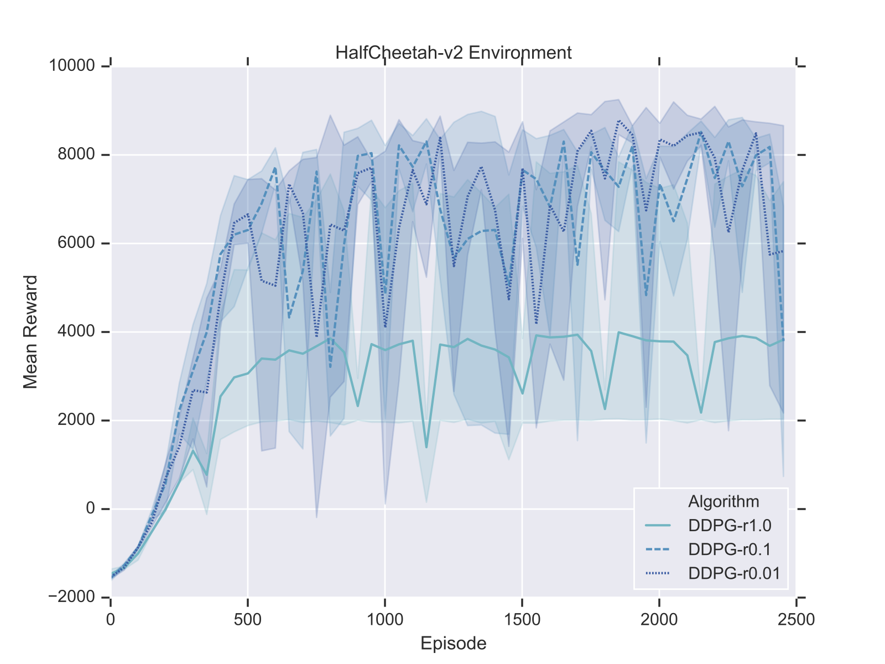

# DDPG-version2

This is an tensorflow implementation of the paper "Continuous control with deep reinforcement learning".

This code is a modified version of [my previous DDPG implementation](https://github.com/fengredrum/DDPG-TensorFlow). The goal of this version is making the program more compact, and capable of solving more complex environment. The computation graph is shown below.

The following figure shows the performance in OpenAI gym's HalfCheetah-v2 environment, where $r1.0$ denotes without reward scaling. 

It can be seen that DDPG is indeed sensitive to the scale of reward. But the difference between $r0.1$ and $r0.01$ seems subtle.

This code is compatible with all of the OpenAI gym MuJoCo domains, and the default environment is HalfCheetah-v2. Typing `python Train.py` in the terminal to run, make sure you've already installed TensorFlow and OpenAI gym. 

Any comment or suggestion is welcome, you can open an issue or contact me via "fengredrum@gmail.com".

## Reference
1. Lillicrap, T. P., Hunt, J. J., Pritzel, A., Heess, N., Erez, T., Tassa, Y., ... & Wierstra, D. (2015). Continuous control with deep reinforcement learning. arXiv preprint arXiv:1509.02971.
2. https://github.com/MorvanZhou/Reinforcement-learning-with-tensorflow
3. https://github.com/songrotek/DDPG
4. https://github.com/RuiShu/micro-projects/tree/master/tf-ema

